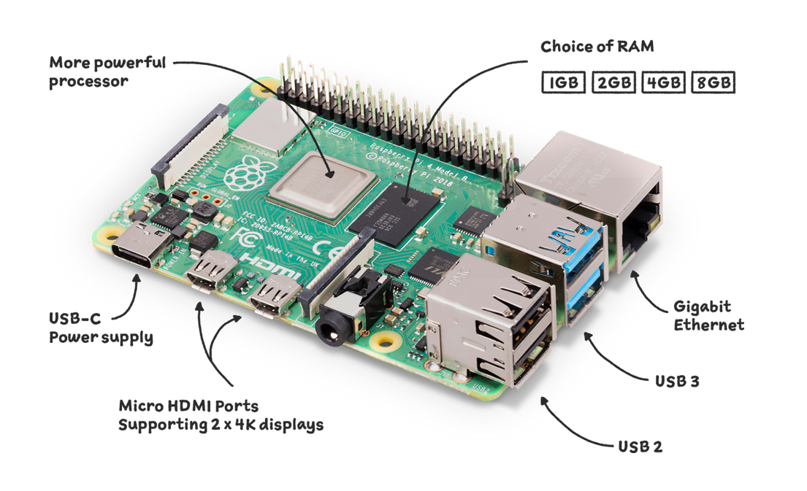

# Deploy TensorflowLite model in Raspberry Pi with Hikvision ip camera



## Introduction

Raspberry Pi has long been the gold standard for inexpensive single-board computing, powering everything from robots to smart home devices to digital kiosks. When it launched in 2019, the Raspberry Pi 4 took Pi to another level, with performance that’s good enough to use in a pinch as a desktop PC, plus the ability to output 4K video at 60 Hz or power dual monitors. More recently, the Raspberry Pi 4 (8GB) model came out, offering enough RAM for serious desktop computing, productivity and database hosting.

## Get started

First of all, you should prepare devices(Raspberry Pi and Hikvision ip camera) to launch program.

It's easy after you watch these demo videos:

1. [Install Raspberry Pi SD card](https://www.youtube.com/watch?v=eS-N8NCB9rk) (You must install 64-bit OS for this project)
2. [Setup Hikvision ip camera](https://www.youtube.com/watch?v=WL0aBcbGIus)

## Installation

1. Clone repo

   ```bash
   https://github.com/shoxa0707/Deploy-Yolov8-in-Raspberry-Pi.git
   cd Yolov8-in-RaspberryPi
   ```

2. Install dependent packages

   ```bash
   pip install -r requirements.txt
   ```

After installation done. The project is ready to launch:

```bash
python run.py
```

## 👀 Demos

Result of the project is as follows:<br>


